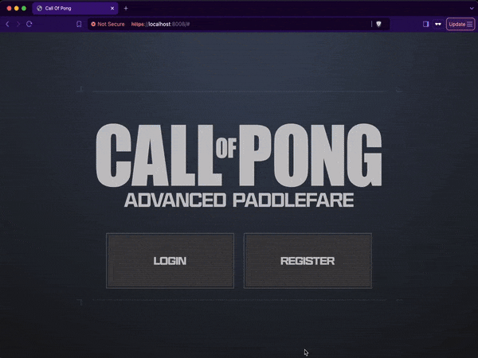
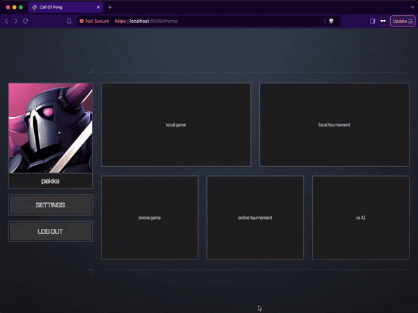

# 42ft_transcendence

## Let's play Call of Pong: Advanced Paddlefare!



It is a fully functional, responsive, and secure web application made from scratch, incorporating both **back-end** and **front-end** tech.
The project emphasizes real-world concepts like authentication, data persistence, real-time communication, and user interface design.

Built as a **single-page** application that dynamically updates the current web page with new data to interact with the user.

There is a matchmaking system that pairs players based on the game mode they are searching for. Passwords are hashed and the website is protected against **SQL** injections/**XSS**. **HTTPS** and **WSS** are implemented in the **back-end** to ensure security. Forms and user input is validated on both the **front-end** and **back-end**. Implements **SSR** to improve the website's loading speed and overall performance. Proven to support at least the **Chrome** and **Firefox** browsers.

You have the option to **invite** other users to online lobbies. There are **five** different game modes available:



Visually it follows the theme of **Call of Duty**, which inspired its name.

You can:
  - Create an account
  - Update your information (name, profile pic, etc)
  - View your game history
  - View other users' profiles
  - Add friends
  - Block users
  - Invite friends to play games
  - Direct message friends
  - Live chat with others in the lobby
  - Play local 1v1
  - Play online 1v1
  - Play local tournaments
  - Play online tournaments
  - Play against AI
  - Customize paddle/ball speed
  - Use the ```cli_client``` to do all the above from the terminal

My role in the team encompassed a wide range of responsibilities, including developing **AI**, implementing chat functionality, creating **Docker** files, working on both the **back-end** and **front-end**, designing the lobby and tournament systems, integrating various components, and debugging issues.

This was the last project of **Hive Helsinki** and it introduced the world of full-stack web development.

## 📖 Topics
  - Full-stack
  - Single-page application
  - Authentication
  - Real-time communication
  - Data persistence
  - Artificial intelligence
  - Asynchronous operations
  - Containerization
  - Security
  - Teamwork

## 🛠️ Langs/Tools
  - Python
  - Django
  - JavaScript
  - HTML
  - CSS
  - Shell script
  - PostgreSQL
  - Docker Compose

## 🦉 Getting started

First make sure you have **Docker Compose** installed on your system. You can just install **Docker Desktop**, it should include **Docker Compose**.
Read more about it ***[here](https://docs.docker.com/compose/install/)***.
  
  1. ```git clone https://github.com/kenlies/42ft_transcendence```
  2. ```cd 42ft_transcendence```
  3. ```docker compose up```
  4. Use **Chrome** or **Firefox** to go to ```https://localhost:8008/```

It will warn you about **HTTPS** because the certificate is self-signed. However, you can proceed safely.

## 💸 Bonus section

The project is structured around modules, each of which adds new functionality to the overall system. For instance, the introduction of AI was implemented as one such module. The bonus component was relatively straightforward: we were tasked with adding additional modules. We went above and beyond by implementing a few extra modules, even surpassing the bonus requirements.

## 🔨 To improve

The Consumers' logic could be improved, and the code layout could be better organized.
Some of the front-end code could be better thought out, particularly in the lobby JavaScript files.
The application can be improved on performance.
